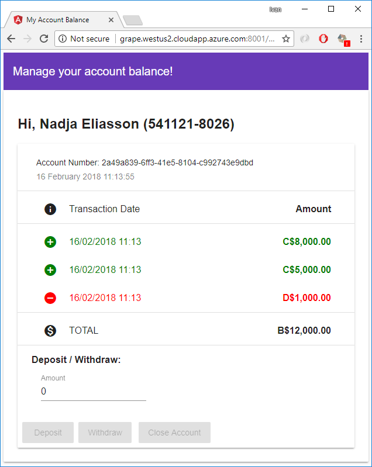

# Amora

The Amora website is an Angular application for the [Acerola](https://github.com/ivanpaulovich/acerola) and [Manga](https://github.com/ivanpaulovich/manga). It is a "working in progress project" and new features come every week. 

# Requirements
* [Angular](https://www.npmjs.com/package/angular)
* [Docker](https://docs.docker.com/docker-for-windows/install/)

# Running the latest Docker Build 

If you like to run a Docker container for this project use the latest image:

```
docker run -p 8001:80 -d \
	--name amora-frontend \
	ivanpaulovich/amora:latest
```
Then navigate to http://localhost:8001 and play with the App.

# We are live on Azure

You can test the application right now by navigating to the [the Amora Website](http://grape.westus2.cloudapp.azure.com:8001 "Amora Website") and registering with your Security Social Number, Given name and your Initial Account balance.  


Then will be redirect to the account balance page where you can Deposit, Withdraw an Close your account.



This source code and website should be used only for learning and **all data is erased weekly**.
